# Multiplex single-fibre phenotyping across serial muscle sections resolves the fibre-state response to micro-dystrophin gene therapy

*Master manuscript draft. Inline citations use `[DOI:…]`; the full reference list is at the end. Figures
1–8 are embedded from `manuscript/figures/`. Statistics are computed at the animal level (per-animal
medians; Mann–Whitney U and Cohen's d; n = 5 WT, 5 mdx, 4 AAV9, 5 LICA1) unless stated; only observed —
actually matched — marker values enter the statistics.*

**Authors.** *[to be completed]*
**Affiliations.** *[to be completed]*

---

## Abstract

Muscle pathology is multi-parametric, but no single histological section can report every marker, and bulk
or single-stain assays average over the profound fibre-to-fibre heterogeneity of dystrophic muscle. We
present **F2FMatcher**, a method that matches individual muscle fibres across serial sections stained with
different markers by encoding fibre *shape* — not stain intensity — with a variational auto-encoder, scoring
same-fibre identity with a pairwise classifier, and enforcing spatial consistency with a geometry-aware
matching algorithm. On an expert-annotated ground truth F2FMatcher reached precision 0.94 / recall 0.89 /
**F1 0.91**, ~2.4× the best of eight baselines including registration and state-of-the-art learned matchers
(DINOv2, LoFTR, RoMa, SuperGlue), whose pixel-level correspondences are recall-heavy but imprecise among
densely-packed, near-identical fibres. Applying F2FMatcher to a seven-panel serial stack of murine
quadriceps, we assembled an 807-feature multiplex table for 111,403 fibres and used it to (i) resolve
dystrophic pathology into six reproducible fibre states and show that dystrophin loss, membrane leak and
immune infiltration are fibre-intrinsic and universal; (ii) demonstrate that regeneration and necrosis are
distinct, sequential fibre states; and (iii) evaluate micro-dystrophin gene therapy at single-fibre
resolution, ranking two capsids at equal dose (myotropic LICA1 restored WT-level sarcolemmal dystrophin in
65% of fibres versus 28% for AAV9). Mechanistically, per-fibre restoration was set by two independent
factors — an intact **laminin/basal-lamina scaffold** (which predicts ~50% of the variance of restored
membrane dystrophin) and the fibre's **regeneration history** (regenerated fibres carry less transgene,
the in-situ signature of AAV episome dilution). Treatment resistance in a large fast-glycolytic fibre state
was architectural rather than a delivery failure — dystrophin was restored yet the morphology and downstream
pathology were not — and gene therapy left residual galectin-3 lysosomal damage, while the non-myotropic
AAV9 left more necrosis than untreated muscle. F2FMatcher turns a stack of differently-stained sections into
a single-fibre atlas that yields mechanism-resolved read-outs inaccessible to bulk measurement.

---

## Introduction

Duchenne muscular dystrophy (DMD) is an X-linked disease caused by loss of dystrophin, a sarcolemmal protein
that links the actin cytoskeleton to the extracellular matrix through the dystrophin–glycoprotein complex
(DGC) [DOI:10.1016/S0140-6736(19)32910-1; DOI:10.1155/2011/210797]. Its absence renders the membrane fragile,
triggering cycles of contraction-induced injury, necrosis, inflammation, regeneration and, ultimately,
fibro-fatty replacement. Adeno-associated virus (AAV)-delivered **micro-dystrophin** — a truncated but
functional transgene — is the leading gene-replacement strategy and has reached the clinic, though efficacy
remains partial: in the phase-3 EMBARK trial the primary functional endpoint was not met despite ~34%
micro-dystrophin expression [DOI:10.1038/s41591-024-03304-z]. Understanding *which* fibres are rescued, *how
completely*, and *why some resist* is therefore central to improving these therapies.

Muscle histopathology is intrinsically multi-parametric — sarcolemmal integrity, immune infiltration,
oxidative metabolism, fibre type, autophagy — but a single section can be stained for only a few markers at
once, and dystrophic muscle is profoundly heterogeneous from fibre to fibre. Bulk assays and single-stain
morphometry average over this heterogeneity and cannot relate one marker to another in the same fibre.
Distributing markers across **serial sections** recovers the panel but creates a correspondence problem:
which fibre in one section is which in the next. This is difficult because (i) the same fibre looks entirely
different across staining modalities (an immunofluorescence membrane outline versus a brightfield
histochemical field), (ii) serial sections undergo local tears and non-rigid distortion so a single global
transform does not align them, and (iii) a whole section contains thousands of near-identical fibres.
Classical image registration returns a warp field rather than fibre identities; general-purpose keypoint
matchers and self-supervised visual features (e.g. DINOv2 [DOI:10.48550/arXiv.2304.07193]) are built for
same-modality scenes and do not assign individual cells across a stain gap.

Here we introduce **F2FMatcher**, which solves the instance-correspondence problem directly and turns a stack
of differently-stained serial sections into a single per-fibre multiplex table. We first describe the method
(§A) and evaluate it against a curated ground truth and eight baselines (§B). We then apply it to murine
quadriceps to resolve the single-fibre pathology of dystrophic muscle (§C) and to evaluate micro-dystrophin
gene therapy — comparing two AAV capsids at equal dose and dissecting the determinants of restoration and
resistance (§D).

---

## Results

### §A. F2FMatcher: fibre-to-fibre matching across histological stains

The design principle that makes cross-stain matching tractable is to **encode fibre shape rather than stain
intensity** (Fig 1a). Each section is segmented with a fine-tuned Cellpose model
[DOI:10.1038/s41592-020-01018-x], which yields per-fibre masks and flow fields (the vector field Cellpose
uses to define boundaries). A 256×256 crop of each fibre's flow field and mask is encoded by a variational
auto-encoder (VAE) into a 256-dimensional latent vector; because the input is flow-field geometry, not the
staining channel, a given fibre embeds almost identically whether stained for laminin or NADH. A pairwise
classifier then scores whether two embeddings are the same physical fibre (validation F1 ≈ 0.94). Appearance
alone cannot disambiguate thousands of similar fibres, so matching combines the classifier score with a
**spatial-signature** similarity (multiscale k-nearest-neighbour distance vectors compared by Wasserstein
distance) and proceeds by triangle-geometry-validated seeding, iterative local propagation, and an affine
fill — imposing global spatial consistency while tolerating local non-rigid distortion between sections
(Fig 1b). Matching every panel to a common anchor section links each fibre across the stack; per-fibre
staining is then quantified in four sub-cellular compartments (whole, membrane ring, peripheral and deep
cytoplasm), giving **807 features per fibre** (15 morphological + 9 statistics × 4 compartments × 22
channels) for 111,403 quadriceps fibres from 19 animals (Fig 1c). This table is the substrate for §C–§D.

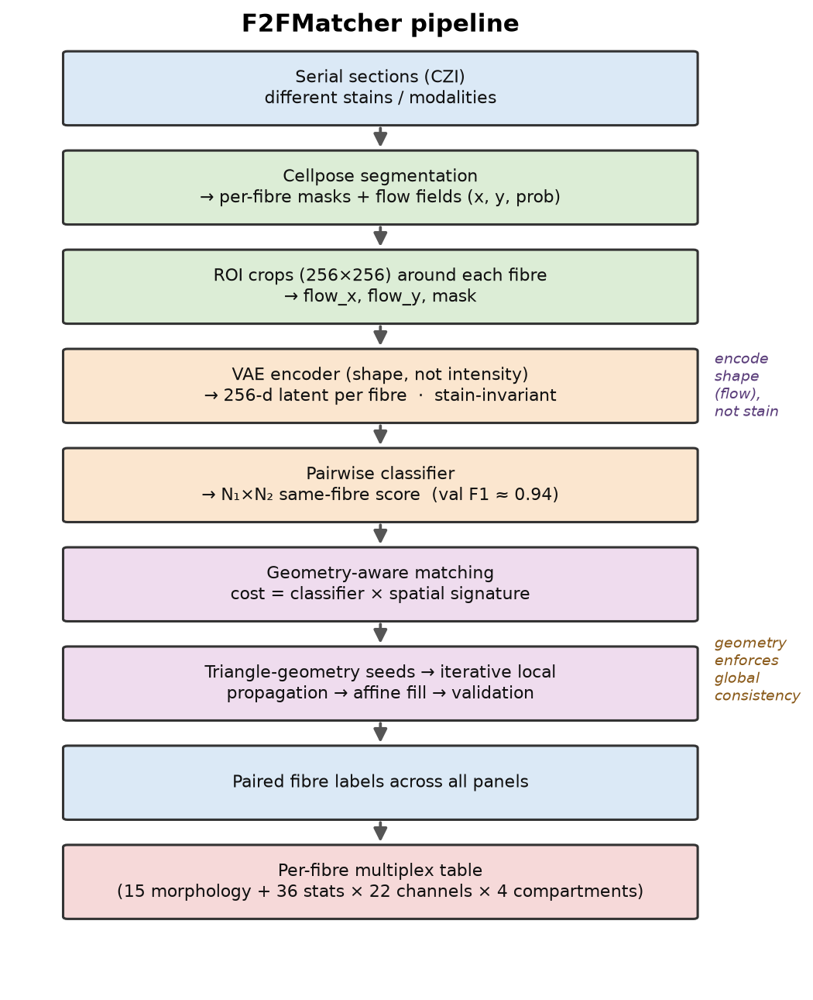

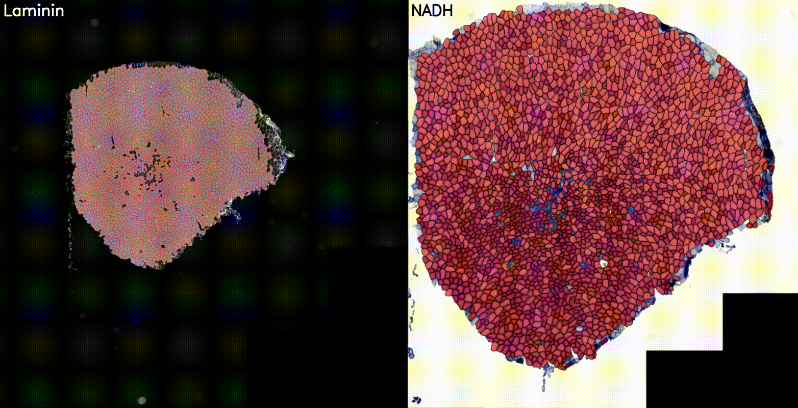

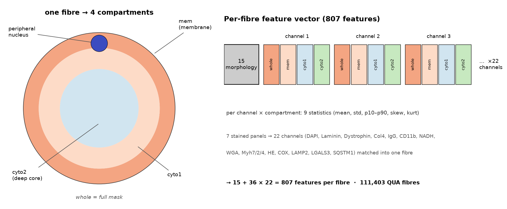

**Figure 1. F2FMatcher matches fibres across differently-stained serial sections into a per-fibre multiplex
table.** (a) Pipeline. (b) Worked example: serial sections stained for laminin (immunofluorescence) and NADH
(brightfield), Cellpose segmentation and F2FMatcher correspondence linking fibres across the modality gap.
(c) The four compartments and the 807-feature per-fibre vector.

### §B. F2FMatcher matches fibres more accurately than registration- and appearance-based methods

Correspondence across a stain gap has no established benchmark, so a claim of accuracy must be earned against
an expert-defined truth and against the strongest available alternatives. We therefore built a curated ground
truth and benchmarked F2FMatcher against eight baselines spanning the three natural strategies for the task —
spatial registration, deep image-region embedding, and general-purpose keypoint matching — and evaluated the
method at two scales: on annotated crops, where precision and recall can be measured exactly, and on whole
sections, where the practical yield and its correctness must hold at the scale of tens of thousands of fibres.
All evaluation was carried out on the cleanest tissue in the study — wild-type quadriceps (30 section-pairs,
190,009 matched fibres) — so that matcher performance is isolated from dystrophic pathology and gene therapy.

**F2FMatcher is highly precise and outperforms every baseline against expert ground truth.** We scored
precision, recall and F1 against **1,315 expert-annotated fibre correspondences** (38 crop-pairs; the
Cellpose label space was exactly reproducible, so every method was scored on identical objects). F2FMatcher
reached **precision = 0.94, recall = 0.89, F1 = 0.91**, roughly **2.4× the F1 of the best competing method**
(Fig 2a). The advantage is driven by precision. Every generic matcher was recall-heavy but imprecise (recall
0.77–0.89 at precision 0.07–0.24): registration by centroid nearest-neighbour (no-alignment kNN F1 = 0.38;
global-affine + kNN 0.22), general keypoint and dense matchers (SuperGlue [DOI:10.48550/arXiv.1911.11763]
0.38; SuperPoint-LightGlue [DOI:10.48550/arXiv.2306.13643; DOI:10.48550/arXiv.1712.07629] 0.36; RoMa
[DOI:10.48550/arXiv.2305.15404] 0.31; LoFTR [DOI:10.48550/arXiv.2104.00680] 0.24), and appearance embedding
(DINOv2 [DOI:10.48550/arXiv.2304.07193] 0.12) all near the chance floor (random F1 = 0.02). The reason is
intrinsic to the tissue: muscle fibres are densely packed and near-identical, so a pixel-, patch- or
centroid-level correspondence routinely lands on a *wrong-but-adjacent* fibre — precisely the error that
learned per-fibre shape features, triangle-geometry validation and local propagation are designed to resolve.
F2FMatcher makes this resolution the core operation and so converts a high-recall guess into a
near-error-free assignment.

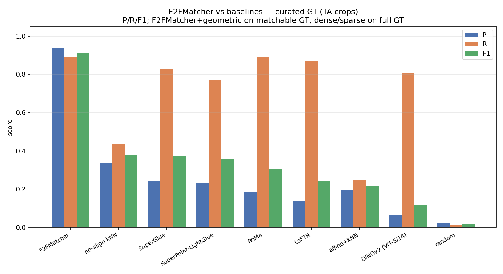

**Every algorithmic component contributes.** Scoring the pipeline stage-by-stage against the same ground
truth showed that no component is redundant: the classifier seeds alone carry most of the recall at moderate
precision (F1 = 0.72), geometry validation raises precision without cost (0.74), local propagation is
conservatively precise (P = 0.93) but prunes recall (F1 = 0.72), and the final affine fill restores recall
while holding precision, yielding the complete pipeline's F1 = 0.91. Shape embedding, geometry and
propagation are thus each necessary, and only their combination attains both high precision and high recall.

**Accuracy is retained at whole-section scale, where coverage alone is misleading.** Crop-level P/R/F1 does
not by itself establish that the method works on a full section of tens of thousands of fibres, where no
ground truth exists. There, the informative question is not how *many* fibres a method assigns (its coverage)
but whether the assigned fibres are the *right* ones — a matcher can trivially assign every fibre at chance
accuracy. We therefore scored all methods on the 30 whole-section WT pairs on two axes simultaneously:
coverage, and a label-free correctness proxy (the shape-consistency of the assigned pairs, validated below).
**F2FMatcher is the only method high on both** (coverage 0.71, correctness AUC 0.87; Fig 2b). Geometry-only
kNN reaches 100% coverage at chance correctness (AUC ≈ 0.49) — it matches everything, half of it no better
than a coin flip. The generic learned matchers trade off the other way: the best of them (RoMa) reaches only
0.45 coverage at 0.75 correctness, and the sparse and appearance matchers collapse on the low-texture
brightfield panels (coverage ≤ 0.15). This is the crop-level precision gap reappearing at scale, and it is
the axis on which coverage-only reporting would have been misleading.

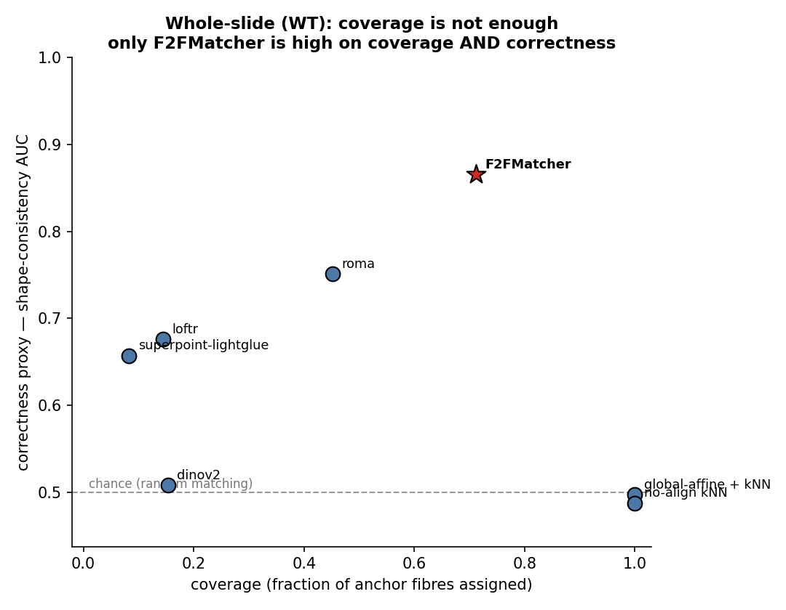

**Coverage tracks segmentation, not the matcher.** In practical use F2FMatcher recovered on average **76.5%**
of fibres per section-pair (71% of anchor fibres, 82% of panel fibres; Fig 2c). Coverage was highest for
panels whose segmentation is concordant with the laminin anchor (NADH 86%, HE 84%, IgG/CD11b 84%, COX 82%)
and lower for the two panels whose own segmentation misses fibres (WGA/Myh 61%, lysosomal 62%). Because the
recoverable ceiling for a panel is set by how many of the anchor's fibres its own segmentation also finds,
this residual is a property of stain-specific segmentation quality, not of the matching algorithm — and it is
the same segmentation dependence that separates the panels on the correctness axis of Fig 2b.

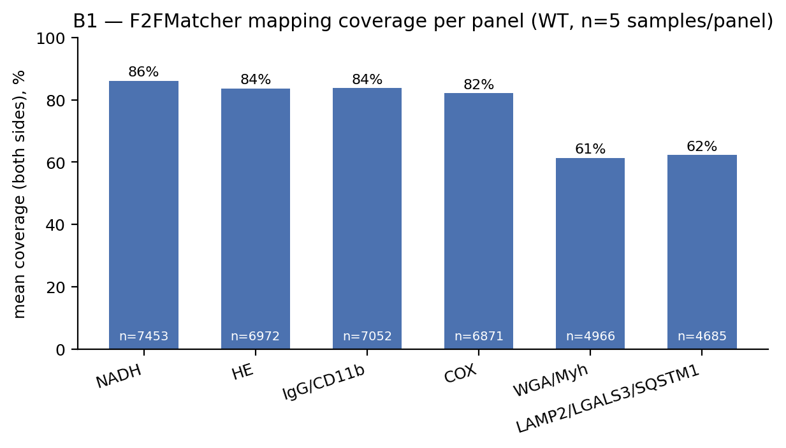

**Two label-free consistency checks corroborate accuracy at full scale.** The correctness proxy used above
rests on two self-supervised properties that a correct set of matches must satisfy and that require no
annotation. First, the same physical fibre has the same shape in two serial sections: F2FMatcher pairs were
**59% more shape-consistent** than random pairs across all 30 section-pairs (mean scale-invariant shape
distance 1.09 vs 2.65; separation AUC = 0.865, per-pair range 0.74–0.93; Fig 2d), whereas both geometry-only
baselines sat at the random level (2.61 and 2.66 vs 2.65; Supplementary Fig S2) — confirming that pure
geometry cannot recover shape-coherent matches. Second, because all six panels are matched to one common
anchor, a correct match is cycle-consistent: an anchor fibre's counterparts across panels must coincide in
space. They did, clustering **2.7× more tightly** than random assignment after robust affine alignment (1,755
vs 4,479 px, per-sample 1.9–3.7×; Fig 2e). Both checks are label-free, agree with the expert-ground-truth
result, and extend it from annotated crops to whole sections.

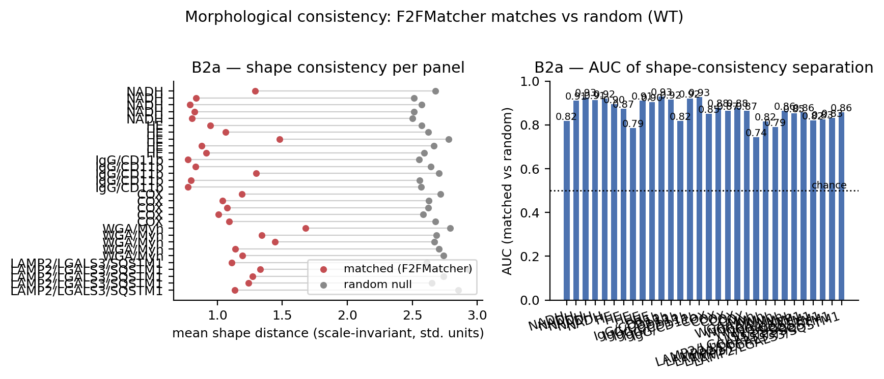

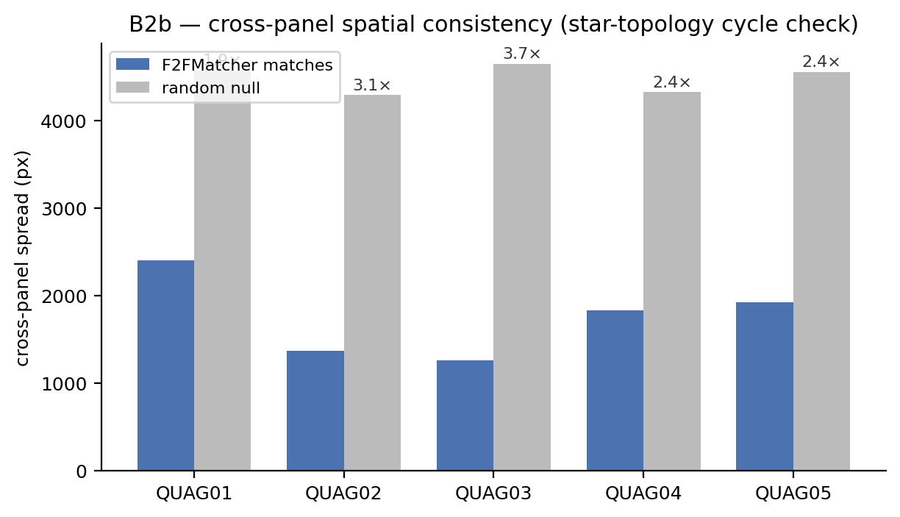

**Figure 2. F2FMatcher matches fibres accurately across the stain gap and outperforms registration- and
appearance-based baselines.** (a) Precision, recall and F1 against a curated expert ground truth (1,315
correspondences, 38 crop-pairs) for F2FMatcher and eight baselines; F2FMatcher F1 = 0.91, ~2.4× the best
baseline. (b) Whole-section evaluation on coverage (fibres assigned) versus a label-free correctness proxy
(shape-consistency AUC); F2FMatcher is the only method high on both axes, whereas geometry-only kNN reaches
full coverage at chance correctness and generic learned matchers reach neither. (c) Coverage per stain-pair
in wild-type quadriceps; the residual reflects stain-specific segmentation concordance, not matcher failure.
(d) Matched fibre pairs are far more shape-consistent than random pairs (AUC = 0.865). (e) Cross-panel
cycle-consistency: an anchor fibre's counterparts across panels cluster 2.7× more tightly than random. Panels
(b,d,e) are label-free and computed on all 30 whole-section pairs; per-method whole-section runtimes and the
geometry-only shape-consistency comparison are in Supplementary Fig S2.

### §C. F2FMatcher reveals the single-fibre pathology of dystrophic muscle

**An unbiased six-state landscape.** Clustering fibres on morphology and haematoxylin–eosin texture only
(no immunofluorescence) and reading out every other marker *post hoc* partitioned the fibres into six
reproducible states (Fig 3a,b): two healthy poles — Cls4 (WT-dominated oxidative type-I fibres, highest
dystrophin) and Cls6 (large fast fibres, dystrophin-high, least inflamed); two diseased poles — Cls2
(smallest, most necrotic/fibrotic) and Cls3 (regenerating, highest central nucleation); a resistant Cls5
(large fast-glycolytic, lowest dystrophin/laminin, almost no WT); and a neutral Cls1 (very large pale
fibres) (Fig 3c). The genotypes already separated on this unbiased map.

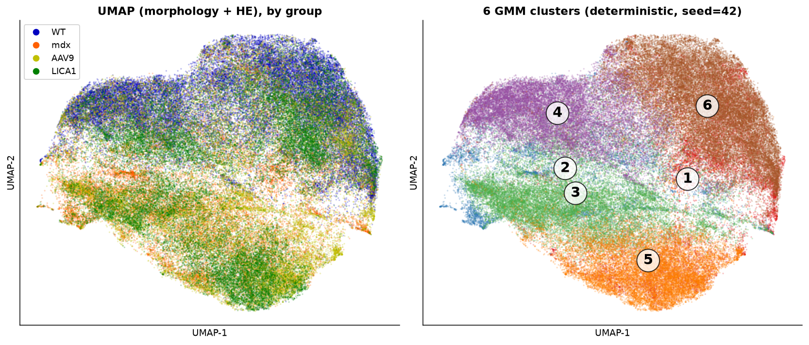

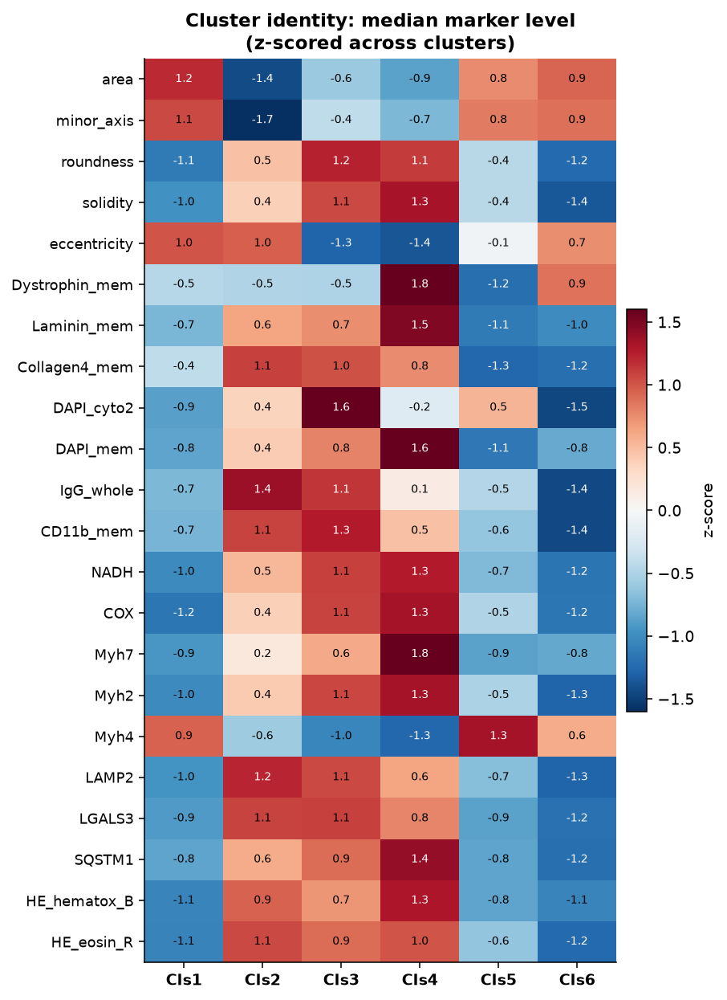

**A fibre-intrinsic, universal disease signature.** mdx versus WT recovered the textbook DMD signature with
large, fully-separated effects (Fig 4a): sarcolemmal dystrophin loss (d ≈ −3.5, p = 0.008), IgG influx
marking membrane leak/necrosis (d ≈ +5.2), CD11b⁺ myeloid infiltration (d ≈ +3.7), increased central
nucleation, and rising fibre-size heterogeneity (CV of fibre area 0.40 → 0.54; both atrophic and hypertrophic
fibres expanding; Fig 4b). Comparing WT and mdx *within* each morphologically-matched cluster showed
dystrophin fell and IgG/CD11b rose in **every** state (Fig 4c) — dystrophin loss and membrane leak are
fibre-intrinsic, not merely compositional. Per-fibre multiplexing further revealed loss of physiological
**marker coupling**: NADH ~ MyHC-I fell from r = 0.88 (WT) to 0.67 (mdx), a negative dystrophin–area coupling
appeared, and basal-lamina/membrane and lysosome–autophagy couplings loosened (Fig 4d).

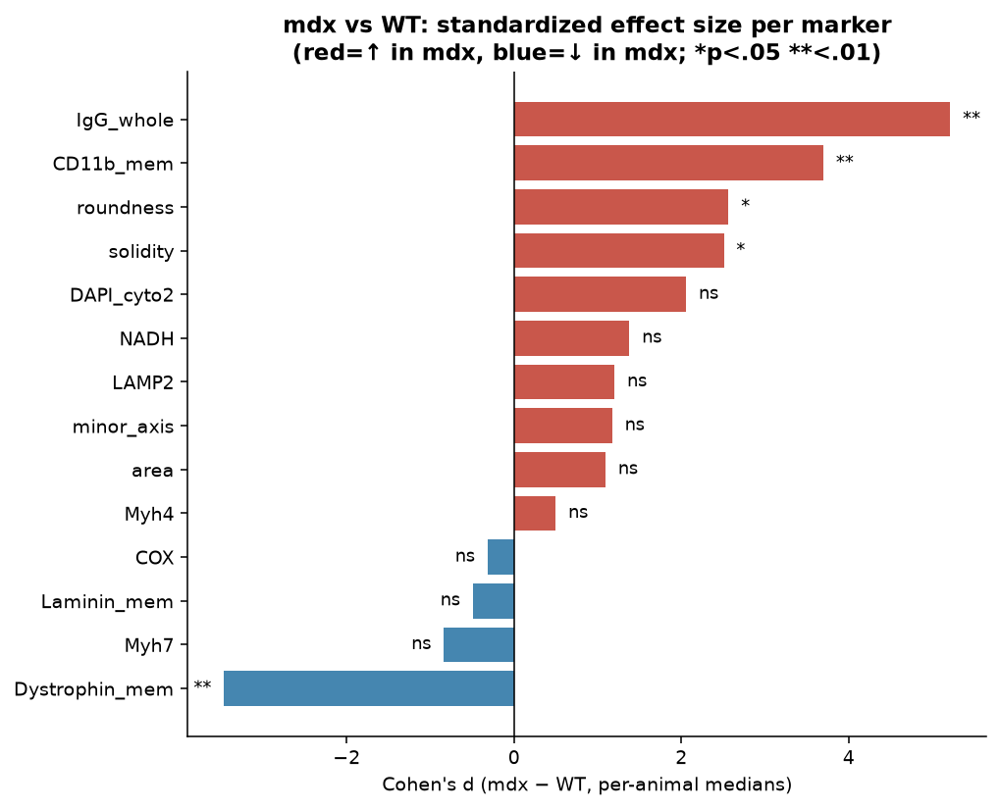

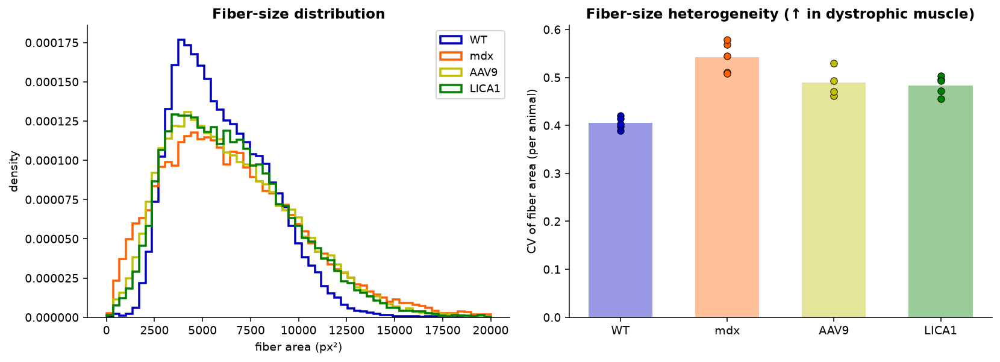

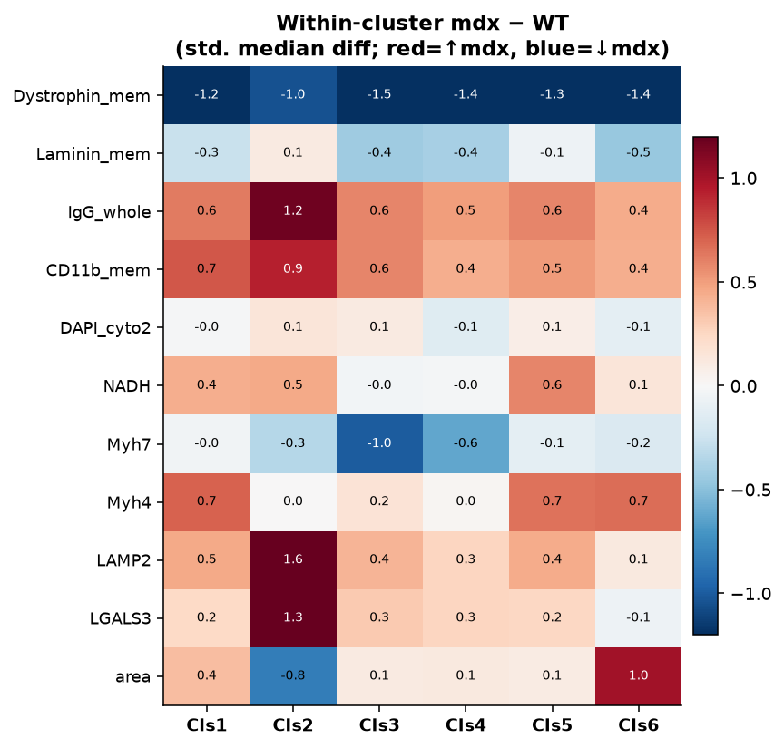

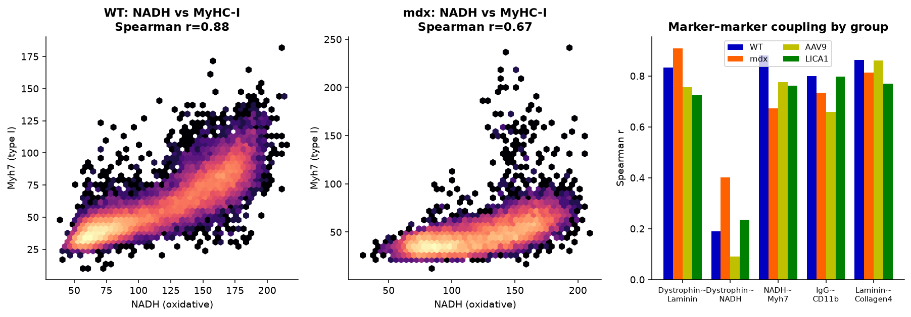

**Regeneration, necrosis and lysosomal stress are distinct fibre states.** Scoring **regenerated
(centronucleated, CN⁺)** fibres from deep-core DAPI variance and **necrotic (IgG⁺)** fibres from sarcolemmal
IgG influx, centronucleation rose from 10% (WT) to 68% (mdx) and marked the disease clusters (Cls5 87%, Cls3
75%). Within mdx, CN⁺ fibres were oxidative and autophagy-active but **no more necrotic or macrophage-
encircled than CN⁻ fibres** (42% vs 40%; 34% vs 34%; Fig 5a). Necrotic fibres were small, round,
**macrophage-encircled** (peri-fibre CD11b +0.86 SD; IgG ~ CD11b r ≈ 0.75), lysosome-loaded, and concentrated
in the small-fibre clusters (Cls2 73%, Cls3 60%), sparing the large clusters (Cls5 20%, Cls6 13%; Fig 5b).
Regeneration and necrosis are therefore distinct, sequential fibre states. The autophagy–lysosome axis was
perturbed — LAMP2, galectin-3 (LGALS3) and p62/SQSTM1 all rose in mdx [DOI:10.1111/apha.12944] — with
p62/SQSTM1 intra-fibre and LAMP2/galectin-3 peri-fibre (a macrophage contribution); galectin-3 reports active
lysosomal-membrane permeabilization [DOI:10.1126/sciadv.adv6805] (Fig 5c).

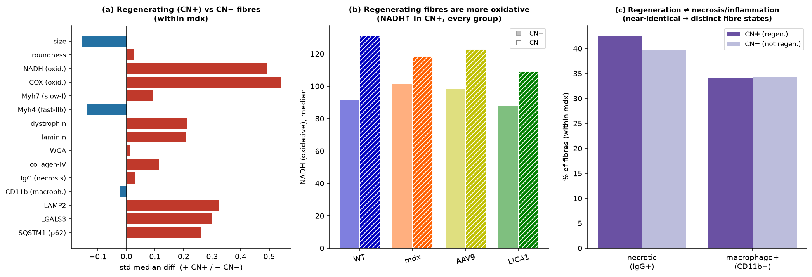

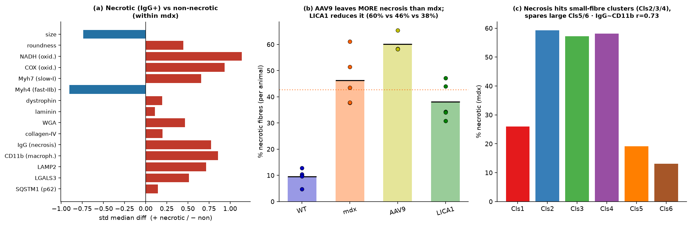

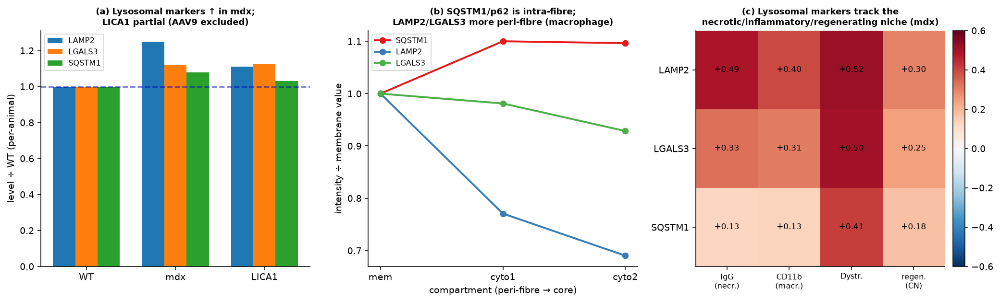

**Figure 3–5.** (3) The unbiased six-state landscape and cluster identities. (4) The fibre-intrinsic mdx
signature and loss of marker coupling. (5) Regeneration, necrosis and lysosomal states are distinct.

### §D. F2FMatcher resolves gene-therapy efficacy at single-fibre resolution

AAV9 and LICA1 delivered the same micro-dystrophin transgene at the same dose, differing only in capsid
serotype (LICA1 is myotropic [DOI:10.1038/s41467-020-19230-w]).

**LICA1 outperforms AAV9.** Both treatments moved fibres out of diseased and back into healthy states, LICA1
more so: the healthy fraction (Cls4+6) rose 12% (mdx) → 31% (AAV9) → 38% (LICA1), and only LICA1 significantly
reduced the regenerating cluster Cls3; the resistant Cls5 was unchanged by either (Fig 6a,b). The central
read-out — sarcolemmal micro-dystrophin — separated the serotypes decisively: the fraction of fibres reaching
WT-level dystrophin rose **3% (mdx) → 28% (AAV9) → 65% (LICA1)**; LICA1 reached or exceeded WT in every
cluster (129–167% restoration) whereas AAV9 restored 44–93% and was highly variable between animals (Fig
6c,d), consistent with the superior muscle transduction of myotropic capsids [DOI:10.1038/s41467-020-19230-w].

**Two determinants of restoration.** Within treated animals, a fibre's membrane dystrophin was predicted
overwhelmingly by its **laminin** (Spearman r ≈ 0.75); in a standardized model laminin dominated (β ≈ +0.75,
R² ≈ 0.5) over fibre type, size and metabolism, and collagen-IV — measured in the same ROI — contributed
nothing (β ≈ 0), ruling out a segmentation artefact and pointing to the DGC–laminin-211 scaffold
[DOI:10.1155/2011/210797] (Fig 7a). A second, independent determinant was **regeneration**: in treated muscle,
regenerated (CN⁺) fibres carried **less** transgene dystrophin (LICA1 −4.7 a.u.; significant within clusters;
β ≈ −0.27 after adjusting for laminin) — the in-situ signature of episomal AAV genome dilution during
regeneration [DOI:10.1038/mt.2013.121] (Fig 7b). Restoration is thus limited by two separable factors, the
laminin scaffold (where dystrophin can sit) and regeneration history (how much vector the fibre retains),
coupled in a feedback loop in which only sufficient dystrophin arrests the cycle. Critically, **laminin is
dystrophin-independent** — preserved in dystrophin-null mdx and unchanged by restoring dystrophin (d ≈ +0.16,
p = 0.69, versus dystrophin's d ≈ +2.4) — so the correct causal statement is *pre-existing laminin scaffold +
delivered dystrophin → function*, not "dystrophin restores laminin" (Fig 7c).

**Resistance is architectural, and residual damage persists.** The resistant Cls5 differs from its healthy
large-fibre twin Cls6 (matched in size, laminin and fibre type) chiefly in low dystrophin and high damage.
LICA1 **fully restored dystrophin in Cls5** (129% of WT) yet the Cls5 fraction did not shrink and its
downstream pathology was not resolved (Fig 8a) — resistance is a **dissociation of molecular from
morphological rescue**: a remodelled fast-glycolytic (MyHC-IIb) architecture, the fibre type most vulnerable
in DMD [DOI:10.1096/fj.202201769R], which dystrophin delivered after damage prevents but does not reverse
[DOI:10.1016/j.yjmcc.2012.05.002] (Fig 8b). Finally, single-fibre read-out surfaced two effects bulk assays
would blur: the necrotic-fibre fraction was WT 10% → mdx 46% → **AAV9 60% → LICA1 38%** — the non-myotropic
AAV9 left *more* necrosis than untreated muscle whereas LICA1 reduced it — and LICA1 only partially
normalised the lysosomal axis, failing to correct galectin-3, independently reproducing the finding that
micro-dystrophin does not fully correct lysosomal damage and that lysosome protection improves outcome
[DOI:10.1126/sciadv.adv6805].

**Figure 6–8.** (6) Compositional and dystrophin restoration, LICA1 vs AAV9. (7) The laminin scaffold and
regeneration penalty, and the laminin causal test. (8) Architectural resistance of Cls5 and per-cluster
restoration.

---

## Discussion

F2FMatcher converts a stack of differently-stained serial sections into a single-fibre atlas, solving an
instance-correspondence problem that registration and general-purpose matchers do not. The decisive result
of the evaluation is one of **precision among near-identical objects**: dense and sparse learned matchers
(RoMa, LoFTR, SuperGlue, DINOv2) recover many correspondences but place them on wrong-but-adjacent fibres
(P ≈ 0.07–0.24), whereas F2FMatcher's shape embedding plus geometry resolves the correct fibre (P = 0.94).
This makes explicit why cross-stain single-fibre phenotyping needs a purpose-built matcher, and the approach
— shape-invariant embedding + geometric consistency — should generalise to other serially-sectioned tissues
where the same objects must be tracked across modalities.

Biologically, per-fibre multiplexing yields read-outs inaccessible to bulk assays. It shows that the DMD
signature is **fibre-intrinsic** in every morphological state; that the degeneration–regeneration cycle
resolves into **distinct** necrotic and regenerated fibre populations; and, for therapy, that two capsids at
equal dose can be ranked quantitatively (LICA1 ≫ AAV9). The mechanistic core is a **two-factor model** of
restoration. First, a fibre can only retain restored micro-dystrophin where its **basal-lamina/laminin
scaffold** is intact — laminin explains ~half the per-fibre variance of membrane dystrophin, specifically
(not collagen-IV) — a single-fibre, in-situ quantification of the DGC–laminin-211 anchoring requirement
[DOI:10.1155/2011/210797]. Because laminin is present in dystrophin-null muscle and is not created by
restoring dystrophin, it is an upstream permissive substrate, not a downstream product; augmenting it (e.g.
laminin-111 or α7β1-integrin) is a rational combination to widen the rescuable pool. Second, **regeneration
imposes a fibre-intrinsic transduction penalty**: regenerated fibres carry less transgene, the spatial
embodiment of episomal AAV dilution during the degeneration–regeneration cycle [DOI:10.1038/mt.2013.121],
which predicts that potency (favouring myotropic capsids) and **early treatment** — before the cycle and the
vulnerable fast-glycolytic architecture are established — should improve durability.

The single-fibre view also reframes **treatment resistance**. The refractory Cls5 state receives and
expresses the transgene (dystrophin ≥ WT) yet does not revert: molecular rescue is dissociated from
morphological rescue in a remodelled fast-glycolytic fibre, consistent with the principle that
micro-dystrophin prevents but does not reverse established structural change
[DOI:10.1016/j.yjmcc.2012.05.002] and with the intrinsic vulnerability of type-IIb fibres
[DOI:10.1096/fj.202201769R]. Two therapy-relevant liabilities emerge that bulk averages hide: the
non-myotropic AAV9 left **more** necrosis than untreated muscle, and gene therapy left a **residual
galectin-3 lysosomal-damage** compartment — independently reproducing recent work showing micro-dystrophin
does not fully correct lysosomal damage and that adding a lysosome-protective agent improves outcome
[DOI:10.1126/sciadv.adv6805]. Together these nominate capsid choice, ECM support, oxidative fibre-type
conversion, early intervention, and lysosome-directed combinations as levers, and position single-fibre
multiplex phenotyping as a mechanism-resolved efficacy assay for the pre-clinical and clinical evaluation of
DMD gene therapies, whose functional benefit in trials remains partial [DOI:10.1038/s41591-024-03304-z].

**Limitations.** The cohort is small (n = 4–5 animals/group) and a single time-point, so the
regeneration↔vector-loss feedback and the "no-reversal" account of resistance are inferred from
cross-sectional data plus prior literature rather than a longitudinal measurement; correlations are
observational. Slide-8 (lysosomal) markers had low mapping coverage for AAV9 (~16%) and were therefore
excluded for that group, and brightfield NADH/COX intensity can be inflated by uptake in leaky fibres. The
expert ground truth was annotated on small crops; the whole-section comparison (Fig 2b) uses label-free
correctness proxies rather than annotations, and quantitative robustness curves (accuracy versus
inter-section distortion, fibre density and segmentation error) remain to be added. Replication in a second
muscle (tibialis anterior data are available) and mixed-effects modelling would further strengthen the
biological claims.

---

## Methods

**Animals and imaging.** Quadriceps (and tibialis anterior) from WT, mdx, and mdx treated with AAV9- or
LICA1-packaged micro-dystrophin at equal dose. Serial sections were stained across seven panels (DAPI/
Laminin/Dystrophin/Collagen-IV; IgG/CD11b; NADH; WGA/Myh7/Myh2/Myh4; HE; COX; LAMP2/LGALS3/SQSTM1) and
imaged as whole-slide CZI, exported to PNG at a common pixel resolution.

**Segmentation and matching (F2FMatcher).** Fibres were segmented with fine-tuned Cellpose 2 models
[DOI:10.1038/s41592-020-01018-x] (cellprob 0, flow 0.4; objects ≥ 100 px²). For each fibre a 256×256
flow-field/mask crop (→ magnitude/angle, 128×128) was encoded by a `SharedMultiHeadVAE` into a 256-d latent
(reconstruction MSE + β_KL·KL, β_KL 0.001, + latent-consistency between augmented views). A pairwise
classifier (MLP 512→128→64→1, dropout 0.5) scored same-fibre probability (BCE, 4× negatives; validation F1 ≈
0.944). Matching cost = classifier × spatial-signature (multiscale k = 3,5,7 kNN-distance Wasserstein);
80 top-scoring seeds filtered by triangle geometry (side < 30, angle < 0.15); iterative local propagation
(200-px neighbourhood, 3-nearest-neighbour triangle validation) to convergence (< 0.25% new pairs/step);
affine fill of unmatched fibres (max distance 150 px, min score 0.5); de-duplication and re-validation.
Defaults in `configs/default.yaml`.

**Feature extraction.** Each matched fibre was partitioned into whole, mem (dilate 4 → erode 4), cyto1
(erode 4 → 12) and cyto2 (erode 12) compartments; nine intensity statistics (mean, s.d., p10, p25, p50, p75,
p90, skew, kurtosis) per channel per compartment plus 15 morphological descriptors gave 807 features per QUA
fibre (663 for TA). Unmatched channels are NaN and excluded from statistics without imputation.

**Evaluation (§B).** Coverage on WT (30 pairs). Label-free accuracy: scale-invariant shape-consistency
distance (matched vs 20,000 random pairs, AUC) and cross-panel cycle-consistency (robust IRLS affine per
panel to the anchor; spread of an anchor fibre's counterparts vs random). Curated ground truth: 1,315
expert-annotated correspondences (38 crop-pairs), P/R/F1 with an edge-ROI correction (F2FMatcher only matches
ROIs whose 256-px window is in-bounds; recall computed over matchable pairs). Baselines: global-affine+kNN
and no-alignment kNN (scored on the same shape metric and GT); DINOv2 (ViT-S/14)
[DOI:10.48550/arXiv.2304.07193], LoFTR [DOI:10.48550/arXiv.2104.00680], RoMa [DOI:10.48550/arXiv.2305.15404],
SuperGlue [DOI:10.48550/arXiv.1911.11763] and SuperPoint-LightGlue [DOI:10.48550/arXiv.1712.07629;
DOI:10.48550/arXiv.2306.13643] via the `vismatch`/`image-matching-models` toolkit, with pixel→ROI assignment
through the Cellpose label map. Ablation: intermediate matched-label sets scored at each pipeline stage.
Whole-section comparison: every method was run on all 30 WT section-pairs and reduced to a 1:1 per-fibre
assignment (learned matchers by majority vote of their correspondences through the Cellpose label map), then
scored on coverage together with the two label-free correctness proxies (shape-consistency AUC and
cross-panel cycle-consistency) and per-pair runtime, so coverage is never reported without a correctness
axis. Scripts under `scripts/`; provenance and full per-pair tables in `manuscript/section_B_evaluation.md`.

**Clustering and statistics (§C–§D).** Fibres detected on the HE panel were clustered on the unbiased "ch3"
feature set (15 morphology + HE brightfield, 123 features): per-feature z-score → PCA(30) → UMAP
[DOI:10.48550/arXiv.1802.03426] → Gaussian-mixture (k = 6, full covariance, `random_state = 42`). The
embedding is precomputed and cached; the GMM labelling is reproduced deterministically. Marker statistics use
observed values only (no imputation), aggregated to per-animal medians; groups compared by Mann–Whitney U
with Cohen's d and, for multivariable prediction, standardized OLS. Centronucleation = deep-core (cyto2)
DAPI-variance above the WT 90th percentile; necrosis = whole-fibre IgG above the WT 90th percentile.
Morphometry via scikit-image [DOI:10.7717/peerj.453]; models via scikit-learn. Analyses are reproducible from
the committed cache (`notebooks/Q1–Q7`, `notebooks/README.md`).

---

## References

1. Mercuri E, Bönnemann CG, Muntoni F. Muscular dystrophies. *Lancet* 2019;394:2025–2038. [DOI:10.1016/S0140-6736(19)32910-1]
2. Mendell JR, *et al.* AAV gene therapy for Duchenne muscular dystrophy: the EMBARK phase 3 randomized trial. *Nat Med* 2024;31:332–341. [DOI:10.1038/s41591-024-03304-z]
3. Gumerson JD, Michele DE. The dystrophin-glycoprotein complex in the prevention of muscle damage. *J Biomed Biotechnol* 2011;2011:210797. [DOI:10.1155/2011/210797]
4. Stringer C, Wang T, Michaelos M, Pachitariu M. Cellpose: a generalist algorithm for cellular segmentation. *Nat Methods* 2021;18:100–106. [DOI:10.1038/s41592-020-01018-x]
5. Weinmann J, *et al.* Identification of a myotropic AAV by massively parallel in vivo evaluation of barcoded capsid variants. *Nat Commun* 2020;11:5432. [DOI:10.1038/s41467-020-19230-w]
6. Le Hir M, *et al.* AAV genome loss from dystrophic mouse muscles during AAV-U7 snRNA-mediated exon-skipping therapy. *Mol Ther* 2013;21:1551–1558. [DOI:10.1038/mt.2013.121]
7. Bostick B, *et al.* AAV micro-dystrophin gene therapy alleviates stress-induced cardiac death but not myocardial fibrosis in >21-m-old mdx mice. *J Mol Cell Cardiol* 2012;53:217–222. [DOI:10.1016/j.yjmcc.2012.05.002]
8. Burke MJ, *et al.* AAV8 and AAV9 myofibre type/size tropism profiling reveals therapeutic effect of microdystrophin in canines. *J Cachexia Sarcopenia Muscle* 2025;16:e13681. [DOI:10.1002/jcsm.13681]
9. Bonato A, *et al.* Cyclin D3 deficiency promotes a slower, more oxidative skeletal muscle phenotype and ameliorates pathophysiology in the mdx mouse. *FASEB J* 2023;37:e23025. [DOI:10.1096/fj.202201769R]
10. Spaulding HR, *et al.* Autophagic dysfunction and autophagosome escape in the mdx model of DMD. *Acta Physiol* 2018;222:e12944. [DOI:10.1111/apha.12944]
11. Jaber A, *et al.* Lysosomal damage is a therapeutic target in Duchenne muscular dystrophy. *Sci Adv* 2025;11:eadv6805. [DOI:10.1126/sciadv.adv6805]
12. Oquab M, *et al.* DINOv2: learning robust visual features without supervision. *Trans Mach Learn Res* 2024. [DOI:10.48550/arXiv.2304.07193]
13. Sun J, Shen Z, Wang Y, Bao H, Zhou X. LoFTR: detector-free local feature matching with transformers. *CVPR* 2021. [DOI:10.48550/arXiv.2104.00680]
14. Sarlin PE, DeTone D, Malisiewicz T, Rabinovich A. SuperGlue: learning feature matching with graph neural networks. *CVPR* 2020. [DOI:10.48550/arXiv.1911.11763]
15. Lindenberger P, Sarlin PE, Pollefeys M. LightGlue: local feature matching at light speed. *ICCV* 2023. [DOI:10.48550/arXiv.2306.13643]
16. DeTone D, Malisiewicz T, Rabinovich A. SuperPoint: self-supervised interest point detection and description. *CVPRW* 2018. [DOI:10.48550/arXiv.1712.07629]
17. Edstedt J, Sun Q, Bökman G, Wadenbäck M, Felsberg M. RoMa: robust dense feature matching. *CVPR* 2024. [DOI:10.48550/arXiv.2305.15404]
18. McInnes L, Healy J, Melville J. UMAP: uniform manifold approximation and projection for dimension reduction. 2018. [DOI:10.48550/arXiv.1802.03426]
19. van der Walt S, *et al.* scikit-image: image processing in Python. *PeerJ* 2014;2:e453. [DOI:10.7717/peerj.453]

*Note on citation format: peer-reviewed articles carry journal DOIs; computer-vision methods without a
journal DOI are cited by their arXiv DOI (`10.48550/arXiv.…`), which resolves to the canonical preprint.*
