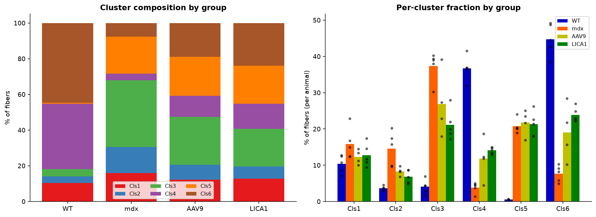
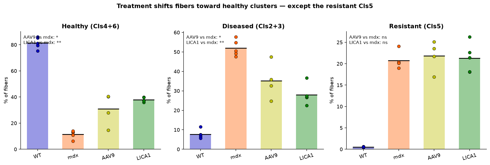
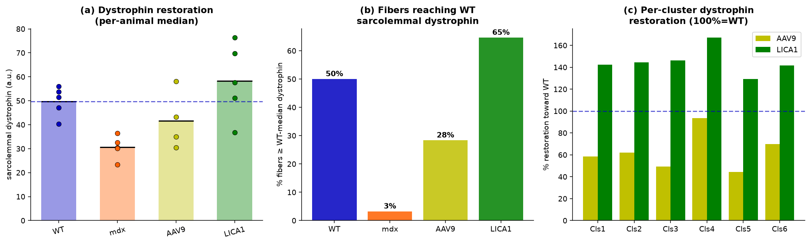
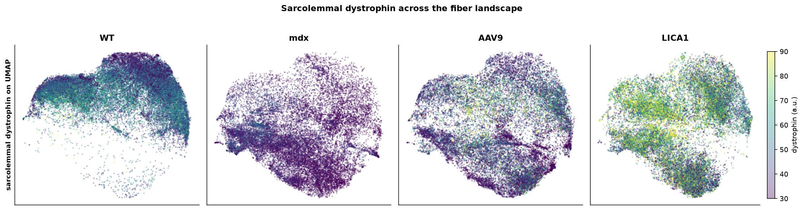
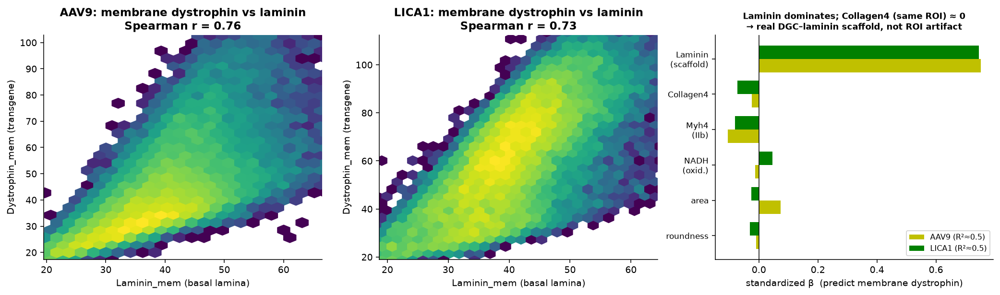
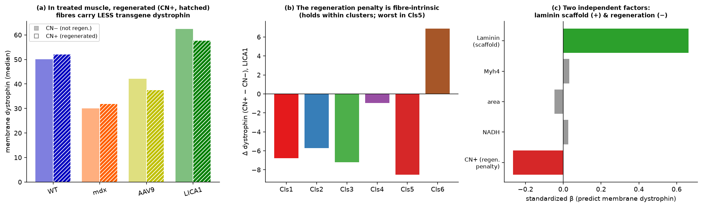
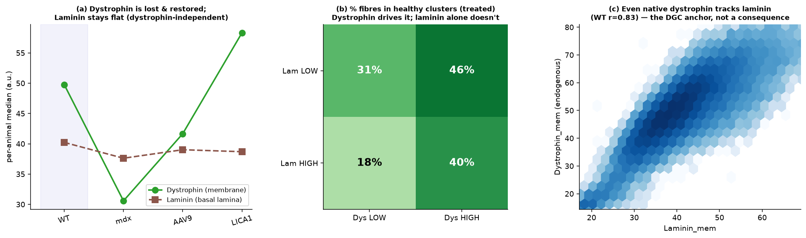
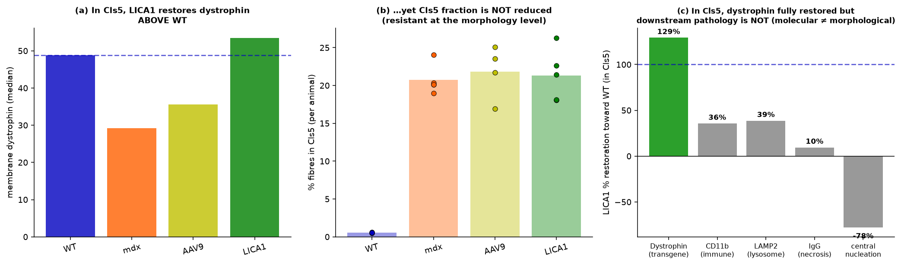
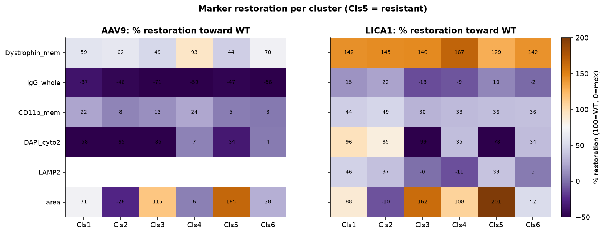

# Results §D — F2FMatcher resolves gene-therapy efficacy at single-fibre resolution

*Draft Results text for theme 4 ("F2FMatcher reveals gene-therapy evaluation"). Figures 6–8 (Figures 1–2 are
reserved for method and evaluation; Figures 3–5 are §C). Statistics as in §C: per-animal medians, Mann–Whitney
U and Cohen's d (n = 5 WT, 5 mdx, 4 AAV9, 5 LICA1); observed values only; AAV9 excluded from slide-8 markers.
AAV9 and LICA1 delivered the **same micro-dystrophin transgene at the same dose**, differing only in capsid
serotype (LICA1 is myotropic).*

Because F2FMatcher reports every marker in every fibre, it turns therapy evaluation from a bulk average into a
per-fibre, per-state readout: *which* fibres are rescued, *how completely*, and *why some resist*.

## D.1 Both serotypes shift fibres toward healthy states — LICA1 more

On the fibre-state map, both treatments moved mdx fibres out of the diseased clusters and back toward the
healthy ones, and LICA1 did so more completely (Fig 6a). Quantifying per animal, the **healthy fraction**
(Cls4 + Cls6) rose from 12% (mdx) to 31% (AAV9) and 38% (LICA1) (LICA1 vs mdx p = 0.008; AAV9 vs mdx p =
0.016), while the **diseased fraction** (Cls2 + Cls3) fell from 52% to 35% (AAV9) and 28% (LICA1) (Fig 6b).
The regenerating cluster Cls3 was reduced significantly only by LICA1 (p = 0.008), not by AAV9 (p = 0.11). In
contrast, the resistant **Cls5** was unchanged by either treatment (mdx 21%, AAV9 22%, LICA1 21%; p ≥ 0.56),
confirming a treatment-refractory fibre state (analysed in D.4).

## D.2 LICA1 restores sarcolemmal dystrophin far more completely than AAV9

The central therapeutic readout — sarcolemmal micro-dystrophin — separated the serotypes decisively
(Fig 6c). The fraction of fibres reaching WT-level membrane dystrophin rose from **3% (mdx) to 28% (AAV9) to
65% (LICA1)**. Per-animal median dystrophin recovered from 30.6 (mdx) to 41.7 (AAV9; 58% of the WT deficit)
and 58.3 (LICA1; 145%, i.e. above WT — micro-dystrophin is strongly over-expressed; LICA1 vs mdx p = 0.008).
LICA1 reached or exceeded WT levels in **every** cluster (129–167% restoration), whereas AAV9 restored only
44–93% and was markedly variable between animals (one responder near WT, the rest low) — the erratic
transduction typical of AAV9 — versus the uniform, high restoration of LICA1 (Fig 6c,d). This consistency,
across all six states and visible directly on the dystrophin UMAP maps (Fig 6d), is the strongest single
argument that the myotropic LICA1 outperforms AAV9 at equal dose, in line with the superior muscle
transduction of engineered myotropic capsids [Weinmann 2020].

## D.3 Two determinants set how much dystrophin a fibre recovers

We asked what governs *where* restored dystrophin lands. Within treated animals, a fibre's membrane
dystrophin was predicted overwhelmingly by its **laminin** level (Spearman r ≈ 0.76 AAV9, 0.73 LICA1). In a
standardized multivariable model, laminin dominated (β ≈ +0.75; R² ≈ 0.5) over fibre type, size and oxidative
state (all ≈ 0), and — critically — collagen-IV, measured in the *same* membrane ROI, contributed nothing
(β ≈ 0), ruling out a segmentation artefact and pointing to the specific **dystrophin–dystroglycan–laminin-211
scaffold** [Gumerson 2011] (Fig 7a). Micro-dystrophin therefore anchors and is retained where the basal
lamina is intact; the basal lamina is the permissive substrate for restoration.

A second, independent determinant emerged from regeneration. Whereas in untreated muscle regenerated (CN⁺)
fibres carried slightly *more* endogenous dystrophin, in **treated** muscle they carried **less transgene**
dystrophin (LICA1 −4.7 a.u.; consistent across all five animals), a penalty that held *within* clusters
(worst in Cls5) and remained significant after adjusting for laminin (β ≈ −0.27) (Fig 7b). This is the
in-situ, single-fibre signature of **episomal AAV genome dilution during regeneration** — regenerated fibres
are built in part from untransduced satellite cells, and each degeneration–regeneration cycle dilutes the
non-integrating vector [Le Hir 2013]. Restoration is thus limited by two separable factors — the **laminin
scaffold** (where dystrophin can sit) and the **regeneration history** (how much vector the fibre retains) —
coupled in a feedback loop in which only sufficient dystrophin arrests the cycle and stabilises the genome;
consistently, LICA1's stronger restoration was accompanied by a lower regeneration burden than AAV9 (§C, D.6).

## D.4 Laminin is a pre-existing scaffold, not a product of dystrophin

Because restored dystrophin tracks laminin, we tested whether dystrophin restoration *creates* laminin.
It does not (Fig 7c). Laminin was essentially preserved in dystrophin-null mdx muscle (40.2 → 37.6; d ≈
−0.5) despite the near-total loss of dystrophin, and restoring dystrophin with LICA1 did **not** raise laminin
(37.6 → 38.7; d ≈ +0.16, p = 0.69) even as dystrophin itself jumped (d ≈ +2.4, p = 0.008); WGA behaved
identically. Conversely, within each laminin stratum, higher dystrophin drove fibres into the healthy states,
whereas laminin without dystrophin did not — and even endogenous WT dystrophin tracked laminin (r = 0.83).
The correct causal statement is therefore *pre-existing laminin scaffold + delivered dystrophin → membrane
repair*, not "dystrophin restores laminin". Where the basal lamina is deficient, augmenting it (e.g.
laminin-111, α7β1-integrin) could widen the rescuable pool.

## D.5 Resistance is architectural: molecular rescue without morphological rescue

The resistant Cls5 state exposed a fundamental limit of gene replacement. Cls5 differs from its healthy
large-fibre "twin" Cls6 (matched in size, laminin and fibre type) chiefly in low dystrophin and high damage
markers (IgG, LAMP2, eosinophilia). Strikingly, **LICA1 fully restored dystrophin in Cls5** (to 53.4,
above WT 48.8; ≈129% restoration) — the transgene *is* delivered and expressed even in the "resistant"
state — **yet the Cls5 fraction did not shrink**, and the downstream pathology was not resolved (within Cls5,
LICA1 restored dystrophin 129% but only 36% of CD11b, 39% of LAMP2, 10% of IgG, and central nucleation
*worsened*) (Fig 8a). Resistance is therefore **not a delivery failure** but a **dissociation of molecular
from morphological rescue**: a remodelled, fast-glycolytic (MyHC-IIb) fibre architecture — the fibre type most
vulnerable in DMD [Bonato 2023] — that dystrophin alone, delivered after damage, prevents but does not reverse
[Bostick 2012]. Consistent with an architectural rather than delivery barrier, marker-level restoration was
strong in the responsive clusters (Cls2/3/4/6) and weak in Cls5 (Fig 8b).

## D.6 A serotype-safety signal and residual, non-rescued damage

Finally, single-fibre read-out surfaced two effects that bulk averages would blur. First, **necrosis**: the
necrotic-fibre fraction was WT 10% → mdx 46% → **AAV9 60% → LICA1 38%** (per animal; every AAV9 animal above
mdx). AAV9 thus left *more* necrotic fibres than untreated muscle, whereas LICA1 reduced necrosis below mdx
(§C, Fig 5b) — a serotype safety/efficacy signal compatible with AAV9 capsid-associated inflammation and its
sub-protective dystrophin levels; at the tissue level LICA1 also lowered IgG below AAV9 (p = 0.016). Second,
**residual lysosomal damage**: LICA1 partially normalised LAMP2 and p62 toward WT but did **not** correct
galectin-3 (LGALS3), the lysosomal-permeabilization marker — micro-dystrophin restores the membrane yet leaves
an active lysosomal-damage compartment. This independently reproduces, at single-fibre resolution, the recent
finding that microdystrophin fails to fully correct lysosomal damage and that adding a lysosome-protective
agent improves outcome [Jaber 2025], and nominates lysosome-directed combination therapy.

---

Together, §D establishes F2FMatcher as a mechanism-resolved efficacy assay: it ranks two clinical-stage
serotypes at equal dose (LICA1 ≫ AAV9), identifies the two determinants that set per-fibre restoration
(laminin scaffold and regeneration/vector-retention), pinpoints the architectural basis of treatment
resistance, and flags residual, non-rescued pathology (necrosis and lysosomal galectin-3) that motivates
combination approaches — read-outs that are inaccessible to bulk or single-stain measurement.

---

### Figure legends (§D)

**Figure 6. LICA1 outperforms AAV9 for compositional and dystrophin restoration.**
(a) Fibre-state composition per group (stacked) and per-cluster fraction with per-animal spread. (b)
Composite healthy (Cls4+6), diseased (Cls2+3) and resistant (Cls5) fractions per animal; stars = MWU vs mdx.
(c) Sarcolemmal dystrophin restoration: per-animal median (left), fraction of fibres reaching WT-level
dystrophin (3% / 28% / 65%; middle), and per-cluster % restoration toward WT (right; 100% = WT). (d)
Dystrophin intensity projected on the fibre-state UMAP for each group.

**Figure 7. Two determinants of restoration and the laminin causal test.**
(a) Membrane dystrophin vs laminin in treated fibres (hexbin, Spearman r) and standardized OLS β predicting
membrane dystrophin — laminin dominates, collagen-IV (same ROI) ≈ 0. (b) Regenerated (CN⁺) fibres carry less
transgene dystrophin: per-group CN⁺ vs CN⁻ (left), within-cluster Δ for LICA1 (middle), and the two-factor
OLS with the regeneration penalty added (right). (c) Laminin is dystrophin-independent: per-animal dystrophin
vs laminin across groups (left), % fibres in healthy clusters by laminin × dystrophin (middle), and WT
endogenous dystrophin ~ laminin (right).

**Figure 8. Treatment resistance is architectural.**
(a) The Cls5 paradox: LICA1 restores dystrophin above WT in Cls5 (left) yet the Cls5 fraction is unchanged
(middle) and downstream pathology is not corrected (right; % restoration of dystrophin vs damage markers). (b)
Per-cluster % restoration of key markers for AAV9 and LICA1, contrasting responsive clusters with the
resistant Cls5.

*Note: AAV9 is excluded from all slide-8 (LAMP2/LGALS3/SQSTM1) analyses (mapping ~16%); slide-7 (COX) LICA1
coverage is ~51% and interpreted cautiously; n = 4–5 animals/group and a single time-point mean that the
regeneration↔vector-loss feedback and the "no-reversal" resistance are inferred from cross-sectional data plus
prior literature rather than a longitudinal measurement.*

### References cited in §C–§D (verified via PubMed)

- **[Jaber 2025]** Jaber A, *et al.* Lysosomal damage is a therapeutic target in Duchenne muscular dystrophy. *Sci Adv* 2025;11(43):eadv6805. doi:10.1126/sciadv.adv6805.
- **[Le Hir 2013]** Le Hir M, *et al.* AAV genome loss from dystrophic mouse muscles during AAV-U7 snRNA-mediated exon-skipping therapy. *Mol Ther* 2013;21(8):1551-8. doi:10.1038/mt.2013.121.
- **[Weinmann 2020]** Weinmann J, *et al.* Identification of a myotropic AAV by massively parallel in vivo evaluation of barcoded capsid variants. *Nat Commun* 2020;11:5432. doi:10.1038/s41467-020-19230-w.
- **[Bostick 2012]** Bostick B, *et al.* AAV micro-dystrophin gene therapy alleviates stress-induced cardiac death but not myocardial fibrosis in >21-m-old mdx mice. *J Mol Cell Cardiol* 2012;53(2):217-22. doi:10.1016/j.yjmcc.2012.05.002.
- **[Bonato 2023]** Bonato A, *et al.* Cyclin D3 deficiency promotes a slower, more oxidative skeletal muscle phenotype and ameliorates pathophysiology in the mdx mouse. *FASEB J* 2023;37(7):e23025. doi:10.1096/fj.202201769R.
- **[Gumerson 2011]** Gumerson JD, Michele DE. The dystrophin-glycoprotein complex in the prevention of muscle damage. *J Biomed Biotechnol* 2011;2011:210797. doi:10.1155/2011/210797.
- **[Spaulding 2018]** Spaulding HR, *et al.* Autophagic dysfunction and autophagosome escape in the mdx model of DMD. *Acta Physiol* 2018;222(2):e12944. doi:10.1111/apha.12944.
